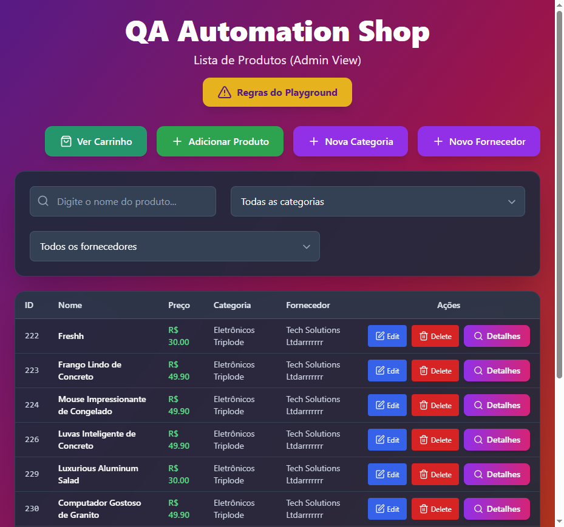
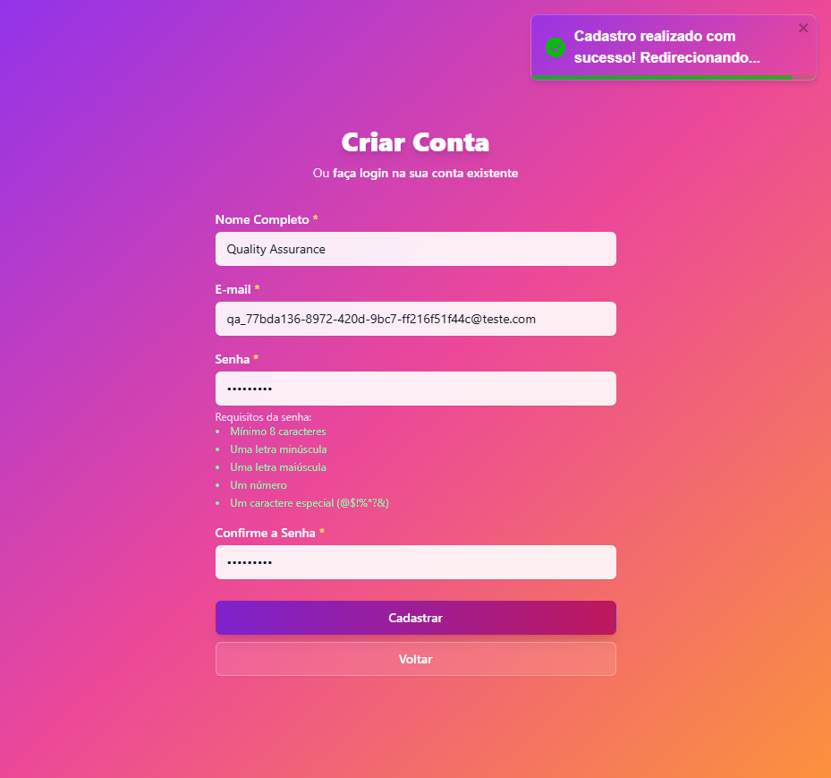
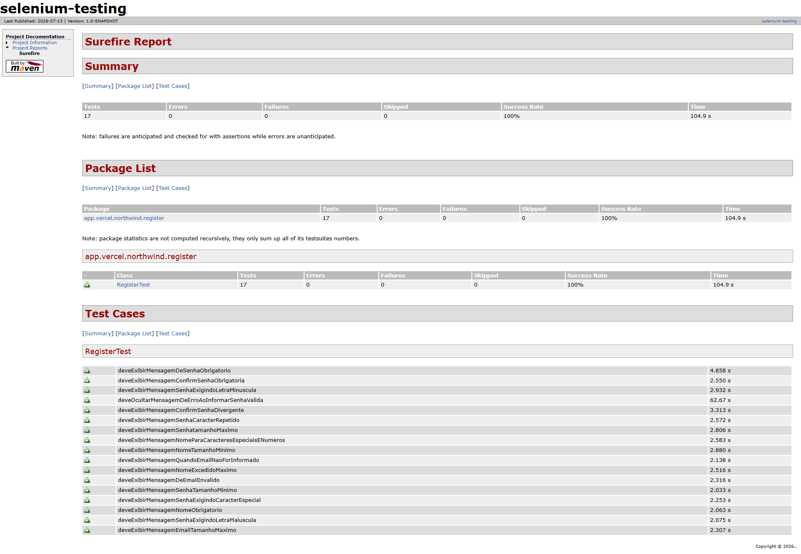

# selenium-northwind


Automação de testes end-to-end para uma aplicação real de gestão de produtos, construída com Selenium 4, Java e JUnit 5.

## Índice

- [Sobre o projeto](#sobre-o-projeto)
- [Stack](#stack)
- [Como executar](#como-executar)
- [Estrutura do projeto](#estrutura-do-projeto)
- [Evidências](#evidências)
- [Relatório](#relatório)

---

## Sobre o projeto

O **selenium-northwind** nasceu como um projeto de estudo e evoluiu para uma suíte de testes automatizados aplicada a uma aplicação web real de gestão de produtos, hospedada na Vercel, com frontend próprio, API em Node.js e persistência de dados no Supabase.

A ideia por trás do projeto foi simular um cenário próximo do que um QA Engineer encontra no dia a dia: uma aplicação viva, com regras de negócio, fluxos de autenticação e cadastros, e a necessidade de garantir que tudo continue funcionando conforme o sistema evolui.

Foram automatizados os principais fluxos críticos da aplicação:

- **Login** — cenários positivos e negativos, validando autenticação e mensagens de erro.
- **Cadastro de usuário** — cenários positivos e negativos, cobrindo validações de formulário.
- **Produtos** — cadastro, listagem e exclusão, validando o CRUD principal da aplicação.
- **Categorias** — testes de criação e validação de categorias vinculadas aos produtos.
- **Fornecedores** — testes de cadastro e gestão de fornecedores.

Além da automação em si, o projeto incorpora boas práticas de mercado: padrão **Page Object** para manutenção facilitada, **captura automática de evidências** (screenshots) em caso de falha, **relatórios HTML** gerados pelo Maven Surefire, e o uso de **IA como apoio na geração e revisão de casos de teste**, acelerando a escrita e ajudando a identificar cenários que poderiam passar despercebidos.

Este repositório representa a aplicação prática de conhecimentos de automação de testes, unindo teoria e execução em um projeto real e funcional.

---

## Stack

| Tecnologia | Finalidade |
|---|---|
|  | Linguagem principal do projeto |
|  | Automação de interações com o navegador (via Selenium Manager) |
|  | Framework de execução e organização dos testes |
|  | Gerenciamento de dependências e geração de relatórios de execução |
|  | IDE utilizada no desenvolvimento |
|   | Versionamento e hospedagem do código |
|  | Apoio na gravação inicial de fluxos de teste |
|  | Organização e acompanhamento das tarefas de teste |
|  | Geração de logs de execução dos testes |

---

## Como executar

### Pré-requisitos

- [Java JDK 25](https://www.oracle.com/java/technologies/downloads/) instalado e configurado no `PATH`
- [Maven](https://maven.apache.org/download.cgi) instalado (ou uso do wrapper `mvnw`, se disponível no projeto)
- Navegador Google Chrome (ou outro navegador suportado) instalado — o **Selenium Manager** cuida do driver automaticamente, sem necessidade de baixar o WebDriver manualmente
- Git instalado

### Passo a passo

1. Clone o repositório:
   ```
   git clone https://github.com/kathleenmiranda/selenium-testing.git
   ```

2. Acesse a pasta do projeto:
   ```
   cd selenium-testing
   ```

3. Instale as dependências via Maven:
   ```
   mvn clean install
   ```

4. Execute toda a suíte de testes:
   ```
   mvn test
   ```

5. Para executar uma classe de teste específica:
   ```
   mvn test -Dtest=LoginTest
   ```

6. Após a execução, os relatórios HTML estarão disponíveis em:
   ```
   target/surefire-reports/
   ```

> 💡 Como o projeto usa o **Selenium Manager**, não é necessário configurar manualmente o ChromeDriver ou qualquer outro driver — tudo é resolvido automaticamente na primeira execução.

---

## Estrutura do projeto

```
src/test/java/app.vercel.northwind
├── BaseTest.java              # Configurações base: setup e teardown do WebDriver
├── page/
│   ├── LoginPage.java         # Mapeamento dos elementos da tela de login
│   ├── ProdutosPage.java      # Mapeamento dos elementos da tela de produtos
│   ├── CategoriaPage.java     # Mapeamento dos elementos da tela de categorias
│   └── FornecedorPage.java    # Mapeamento dos elementos da tela de fornecedores
├── login/
│   └── LoginTest.java         # Cenários de login (positivos e negativos)
├── produtos/
│   └── ProdutosTest.java      # Cenários de cadastro, listagem e exclusão de produtos
└── categorias/
    └── CategoriaTest.java     # Cenários de categorias

evidencias/                    # Screenshots capturados automaticamente em falhas
target/surefire-reports/       # Relatórios HTML gerados pelo Maven Surefire
```

O uso do padrão **Page Object** separa a lógica de localização de elementos da lógica dos testes, tornando a manutenção mais simples: alterações na interface da aplicação exigem ajustes apenas nas classes de `page/`, sem impactar diretamente os testes.

---

## Evidências

Sempre que um teste falha, uma captura de tela é gerada automaticamente para facilitar a análise do problema.

As imagens ficam salvas na pasta [`/evidencias`](./evidencias).



---

## Relatório

Os relatórios de execução são gerados automaticamente pelo **Maven Surefire Plugin** em formato HTML, trazendo o resumo de testes executados, aprovados, falhos e o tempo de execução de cada suíte.

Exemplo de referência de imagem:



---

Projeto desenvolvido como parte da jornada de estudo e prática em Automação de Testes, aplicando na prática o que foi aprendido sobre Selenium, Java, JUnit 5 e boas práticas de QA.
